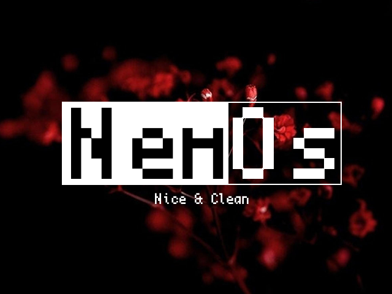
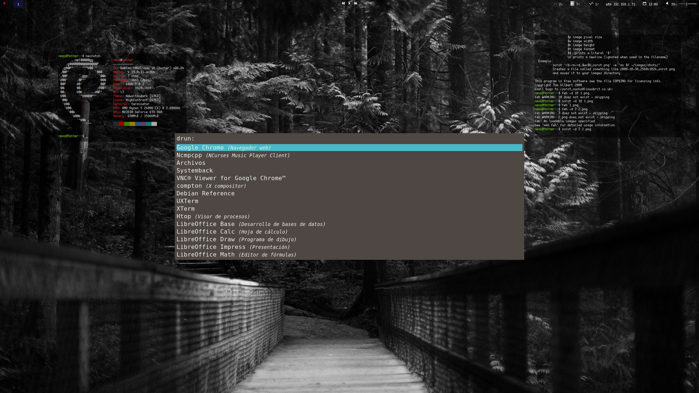
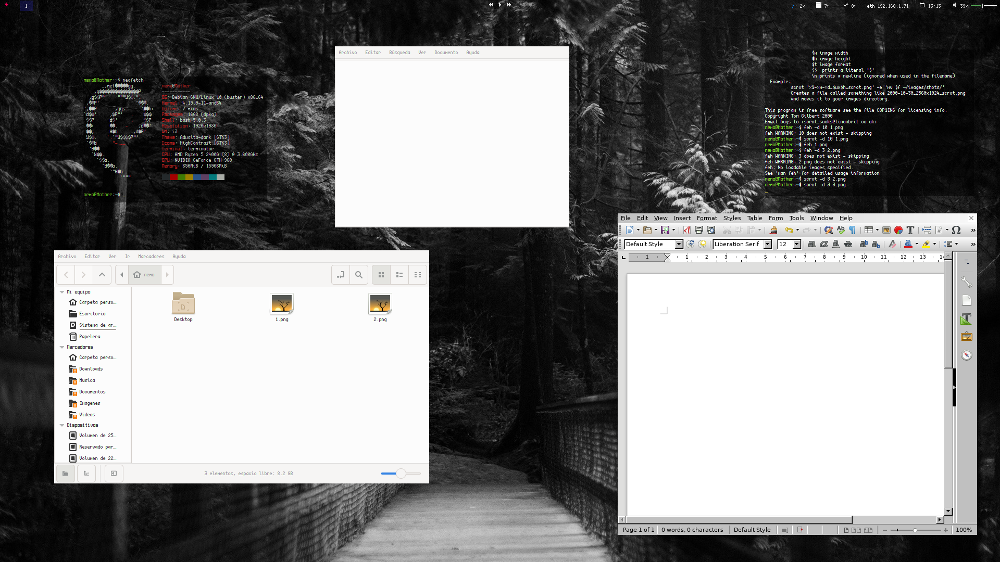
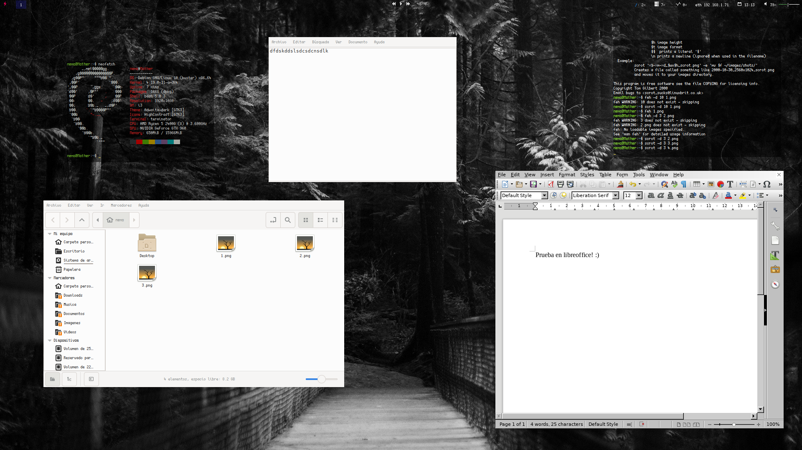
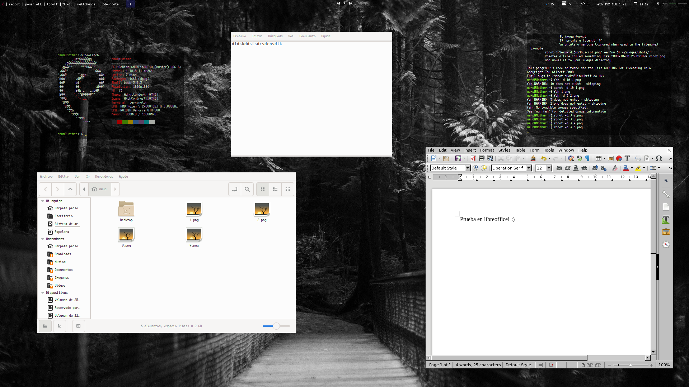
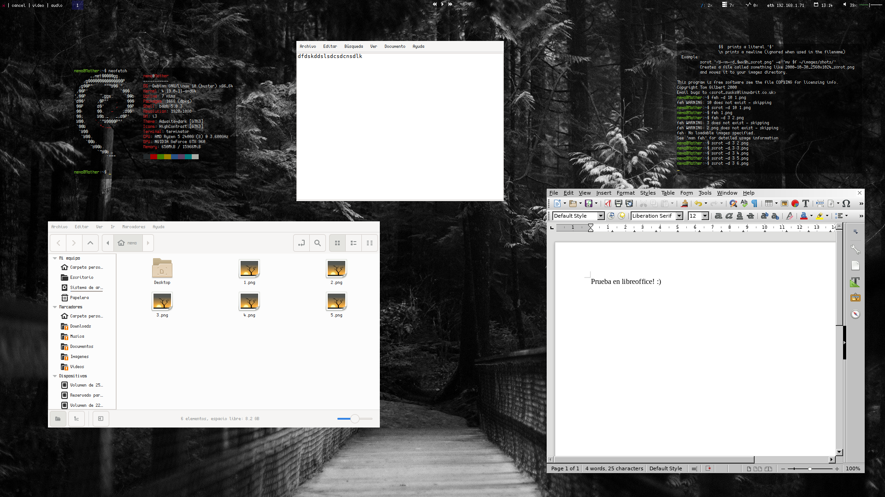
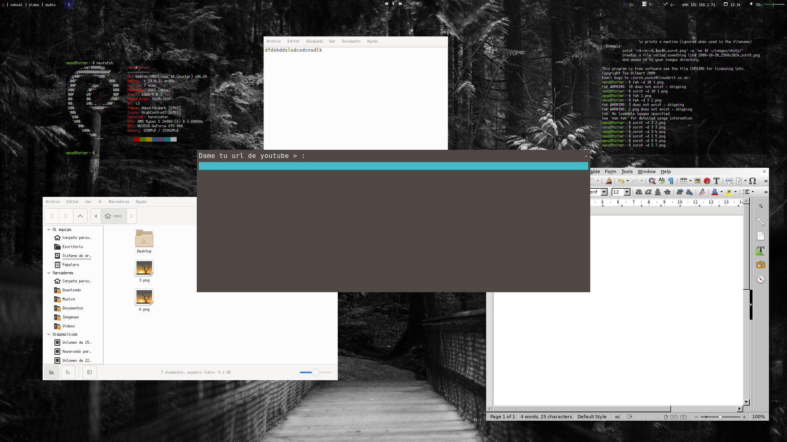

# Bienvenido a NemOs

  

Buen dia viajante, te preguntaras que es **NemOs**

Derivado del latin nemo = nadie 
Os = Operative System

Eh creado **NemOs**  
NemOs es una distribucion basada en debian, preconfigurada para verse hermosa(en mi perspectiva :')) ademas de funcional, sin software de mas, simplemente lo necesario
y una que otra funcion mamalona (increible)

NemOs aun se encuentra en desarollo puede tener errores, puede que algunas cosas no funcionen bien, si quieres colaborar conmigo o solo notificar el error te puedes poner en contacto via telegram o correo electronico!
Tan rapido como pueda o disponga de tiempo me gustaria solucionarlo.

Lista de software instalado (ultima version)

- i3
- xorg
- slim
- google chrome
- libre office
- notepad++
- wine
- rofi
- lxappearance
- nemo
- python3-pip
- telegram-send
- youtube-dl
- dunst
- polybar
- cups

### Imagenes de la version 0.1.1 Babyshell

  
<h2>Imagenes de la version 0.1.0 Babyfish</h2>

  
  
  
  
  
  
  

[Descarga NemOs.0.1.1 Babyshell](https://racaty.net/ah0vufwc1isx)  
[Descarga NemOs.0.1.0 Babyfish](https://racaty.net/s1liryqskepy)

### Contacto

Cualquier apoyo, duda o comentario sera bien recibido  
Telegram: @ducl1296  
Correo: ducl1296@gmail.com
